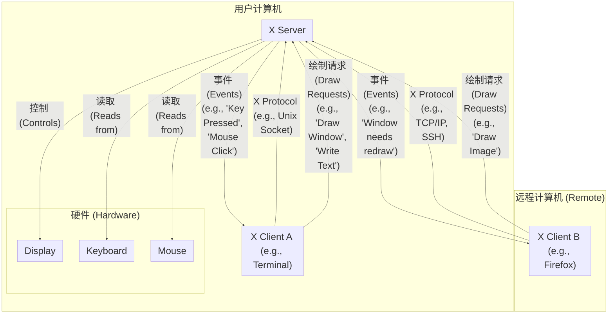

使用ssh连接到远程ubuntu服务器，如何使用GUI？首先需要了解，目前ubuntu使用两种图形程序：X11和Wayland。虽然最新的Ubuntu24已经全面转向Wayland，但是依然兼容X11。本文会依次介绍X11和Wayland的远程访问。

## X11
X11是传统的linux图形程序。其主要架构可理解为：  
**客户端-服务器模型：**
* X Server：运行在本地或远程，直接管理显卡和输入设备。
* X Client：应用程序（如浏览器、文本编辑器）作为客户端，通过 X11 协议与 X Server 通信。



所以，如果需要在ssh远程连接时，也可以使用gui，就需要配置本地终端的客户端，接收来自远程机器服务端的事件。

具体来说，首先需要本地主机有x11客户端。
* Ubuntu自带。
* Windows则需自行安装。但是值得注意的是，wsl是有自己的x11客户端的（事实上，wslg是基于wayland的，而wsl又有xwayland进行兼容），所以如果在wsl里运行ssh，则不需要再安装额外的x11客户端。
* macos需要安装xquartz。但是xquartz是我见过对x11支持最不完善的，但是macos没得选。

这时，只需要运行
```shell
ssh -CY user@ip -p port
```
ssh就会自动配置x11转发。

_x11可视化的结果，可以看到gedit的窗口边缘是直角_

## Wayland
Wayland是更现代、更精于维护的显示接口。在Ubuntu2204起，就已经全面倒向Wayland了。与X11的服务端、客户端模型不同，Wayland是一个合成器，直接管理图形绘制。因此，无法直接从远程访问它。但是，可以使用[waypipe](https://github.com/deepin-community/waypipe)来进行转发。  
本地和远程主机都安装好waypipe后，可以运行
```shell
waypipe ssh user@ip -p port
```
即可。

## XWayland
XWayland是Wayland用以兼容只支持X11应用程序的工具，通常会随着Ubuntu一起安装。大名鼎鼎的WSL也是基于XWayland显示传统X11应用程序的。在Ubuntu2204全面倒向Wayland之后，几乎所有X11程序都是经过XWayland转译之后显示的。那么，这在我们远程时会引来两个问题：
* Ubuntu2204及以后的系统，底层基于Wayland，X11程序通过XWayland转换，无论是使用`ssh -CY`还是`waypipe ssh`，都是可以显示Wayland和X11程序的。
* Ubuntu2004及以前的系统，底层基于X11，所以只有`ssh -CY`可以进行X11转发，从而进行可视化。