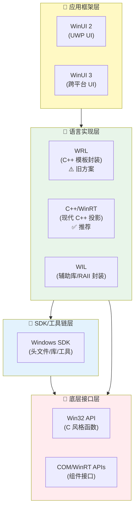
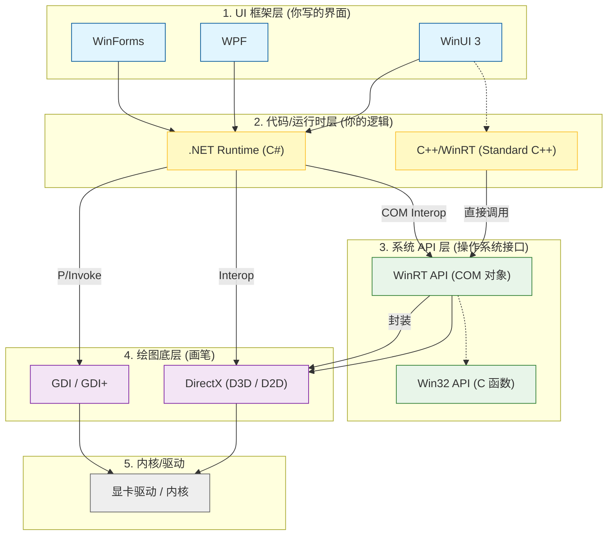

众所周知，在Windows11以前，旧版本的Windows可以使用注册表项来自定义右键菜单。然而，在Windows11中，微软为了解决繁冗的右键菜单问题，将注册表项管理的右键菜单，隐藏到了二级目录中。而对一级右键菜单做了诸多限制。本文将提供自定义一级右键菜单的方法。  

**参考**：
1. [Win11ContextMenu](https://github.com/xandfis/W11ContextMenuDemo)
2. [Win32](https://learn.microsoft.com/en-us/windows/win32/learnwin32/learn-to-program-for-windows)
3. [C++/winrt](https://learn.microsoft.com/en-us/windows/uwp/cpp-and-winrt-apis/get-started#modify-a-windows-desktop-application-project-to-add-c++-winrt-support)
4. [IExplorerExamples](https://github.com/cjee21/IExplorerCommand-Examples)
5. [Windows Implementation Libraries](https://github.com/microsoft/wil)
6. [IExplorerCommand](https://learn.microsoft.com/en-us/windows/win32/api/shobjidl_core/nn-shobjidl_core-iexplorercommand)
7. [Windows Application Package Project](https://learn.microsoft.com/en-us/windows/msix/desktop/desktop-to-uwp-packaging-dot-net)
8. [Package Manifest](https://learn.microsoft.com/en-us/uwp/schemas/appxpackage/uapmanifestschema/schema-root)
9. [Custom Context Menu](https://github.com/ikas-mc/ContextMenuForWindows11)

你不需要了解以上所有内容以实现自定义右键菜单，但是最好对其实现机制有所了解。Windows11中，实现右键菜单注册，必须以如下方式进行：**继承并实现IExplorerCommand类，导出为dll**、**编写package manifest，注册包**、**签名生成的包，并安装它**。其机理是：Windows11的一级菜单由资源管理器管理，资源管理器在右键菜单被触发的时候（比如你右键了一个文件，或者在桌面右键），会查询所有注册的COM组件，如果该COM组件实现了IExplorerCommand类，资源管理器就会根据该类的具体实现，显示条目并准备点击后执行对应的代码。那么上述步骤对应的机理就很明显了。首先，你需要有一个实现了IExplorerCommand类的dll，以供资源管理器调用。其次，你需要使用package manifest，告诉Windows你要将该dll注册为COM组件，并且提供exe程序，使其能够成为一个应用包。最后，为了安装这个包，你需要签名它并且安装，安装时Windows就会根据你的package manifest来注册COM组件。

> COM是Windows中的**组件对象模型**，它是一种规范而非一种实现。作用是统一多种编程语言的二进制实现，使得不论是什么语言编写的dll都能由系统调用，避免由于语言实现不同，导致不同语言编写的dll无法被统一调用。你无需关心COM组件及其编写。对于C++而言，你可以将COM组件理解为一个继承了IUnknown的C++类，而IUnknown则是一个纯虚类，你需要继承他并完善它。如果你想了解更多COM组件，可以参考：[COM简介](https://blog.csdn.net/lwwl12/article/details/102784875)
{: .prompt-info }

在开始之前，还需要解释一件事。如何使用package manifest将一个exe和dll变成一个应用包呢？这里你需要知道，在Windows11里，应用包指的是由Windows打包程序打包的文件。它会生成拓展名为.msix或.msixbundle等的包，你在应用商店里安装的都是这种包。在Windows8第一次提出了uwp（Windows通用应用程序，与传统的win32应用程序相对）之后，微软的Windows程序设计出现了巨大的改变，现在许多名词十分复杂。

_微软Windows程序开发框架_

_常见的微软Windows开发路径_

简而言之，`win32`是所有的系统级api，非常复杂繁琐。而COM则是为了应对不同语言和面向对象开发的实现，底层仍然是各种`win32`api。直接编写COM和`win32`都非常的复杂，所以微软提供了一些语言级别的封装。`WRL`是老的实现，现在已经弃用了。而`c++/winrt`则是新的实现。`wil`是另一个封装，与`c++/winrt`互补。再往上的`winui2(uwp)`,`winui3`都是ui层面的。区别是前者只能在uwp应用中使用，而后者可以应用于任何应用程序。uwp应用是遵循微软的沙盒限制的应用，它不被允许调用大多数win32的api，只能调用winrt封装好的一些。与之相对的，则是win32应用（传统应用），可以调用任何api，无论是封装了的，还是裸的win32的。  

Windows11规定，必须用打包项目将一个exe（无论是传统win32还是uwp）和一个dll（通常只能是win32）使用package manifest打包成一个应用包，才能将其安装并注册。这个打包项目可以是Visual Studio中的打包项目，也可以仅仅只是一个Appxmanifest.xml文件。

下面，将正式提供自定义一级右键菜单的方法。

## 传统win32应用+打包项目
最简单的方式就是使用任何一个exe程序，一个编写好的继承了IExplorerCommand类与一个AppxManifest.xml文件实现。因此，这种实现方式的困难是实现一个IExplorerCommand类的dll和AppxManifest.xml文件的编写，我们一步一步来。
### 编写DLL
