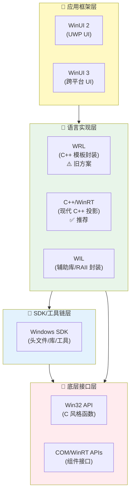
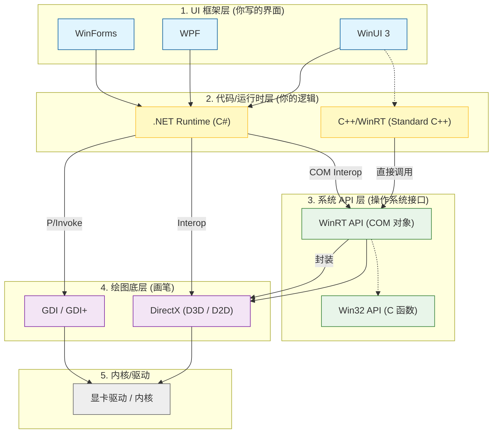

众所周知，在Windows11以前，旧版本的Windows可以使用注册表项来自定义右键菜单。然而，在Windows11中，微软为了解决繁冗的右键菜单问题，将注册表项管理的右键菜单，隐藏到了二级目录中。而对一级右键菜单做了诸多限制。本文将提供自定义一级右键菜单的方法。  

**参考**：
1. [Win11ContextMenu](https://github.com/xandfis/W11ContextMenuDemo)
2. [Win32](https://learn.microsoft.com/en-us/windows/win32/learnwin32/learn-to-program-for-windows)
3. [C++/winrt](https://learn.microsoft.com/en-us/windows/uwp/cpp-and-winrt-apis/get-started#modify-a-windows-desktop-application-project-to-add-c++-winrt-support)
4. [IExplorerExamples](https://github.com/cjee21/IExplorerCommand-Examples)
5. [Windows Implementation Libraries](https://github.com/microsoft/wil)
6. [IExplorerCommand](https://learn.microsoft.com/en-us/windows/win32/api/shobjidl_core/nn-shobjidl_core-iexplorercommand)
7. [Windows Application Package Project](https://learn.microsoft.com/en-us/windows/msix/desktop/desktop-to-uwp-packaging-dot-net)
8. [Package Manifest](https://learn.microsoft.com/en-us/uwp/schemas/appxpackage/uapmanifestschema/schema-root)
9. [Custom Context Menu](https://github.com/ikas-mc/ContextMenuForWindows11)

你不需要了解以上所有内容以实现自定义右键菜单，但是最好对其实现机制有所了解。Windows11中，实现右键菜单注册，必须以如下方式进行：**继承并实现IExplorerCommand类，导出为dll**、**编写package manifest，注册包**、**签名生成的包，并安装它**。其机理是：Windows11的一级菜单由资源管理器管理，资源管理器在右键菜单被触发的时候（比如你右键了一个文件，或者在桌面右键），会查询所有注册的COM组件，如果该COM组件实现了IExplorerCommand类，资源管理器就会根据该类的具体实现，显示条目并准备点击后执行对应的代码。那么上述步骤对应的机理就很明显了。首先，你需要有一个实现了IExplorerCommand类的dll，以供资源管理器调用。其次，你需要使用package manifest，告诉Windows你要将该dll注册为COM组件，并且提供exe程序，使其能够成为一个应用包。最后，为了安装这个包，你需要签名它并且安装，安装时Windows就会根据你的package manifest来注册COM组件。

> COM是Windows中的**组件对象模型**，它是一种规范而非一种实现。作用是统一多种编程语言的二进制实现，使得不论是什么语言编写的dll都能由系统调用，避免由于语言实现不同，导致不同语言编写的dll无法被统一调用。你无需关心COM组件及其编写。对于C++而言，你可以将COM组件理解为一个继承了IUnknown的C++类，而IUnknown则是一个纯虚类，你需要继承他并完善它。如果你想了解更多COM组件，可以参考：[COM简介](https://blog.csdn.net/lwwl12/article/details/102784875)
{: .prompt-info }

在开始之前，还需要解释一件事。如何使用package manifest将一个exe和dll变成一个应用包呢？这里你需要知道，在Windows11里，应用包指的是由Windows打包程序打包的文件。它会生成拓展名为.msix或.msixbundle等的包，你在应用商店里安装的都是这种包。在Windows8第一次提出了uwp（Windows通用应用程序，与传统的win32应用程序相对）之后，微软的Windows程序设计出现了巨大的改变，现在许多名词十分复杂。

_微软Windows程序开发框架_


_常见的微软Windows开发路径_

简而言之，`win32`是所有的系统级api，非常复杂繁琐。而COM则是为了应对不同语言和面向对象开发的实现，底层仍然是各种`win32`api。直接编写COM和`win32`都非常的复杂，所以微软提供了一些语言级别的封装。`WRL`是老的实现，现在已经弃用了。而`c++/winrt`则是新的实现。`wil`是另一个封装，与`c++/winrt`互补。再往上的`winui2(uwp)`,`winui3`都是ui层面的。区别是前者只能在uwp应用中使用，而后者可以应用于任何应用程序。uwp应用是遵循微软的沙盒限制的应用，它不被允许调用大多数win32的api，只能调用winrt封装好的一些。与之相对的，则是win32应用（传统应用），可以调用任何api，无论是封装了的，还是裸的win32的。  

Windows11规定，必须用打包项目将一个exe（无论是传统win32还是uwp）和一个dll（通常只能是win32）使用package manifest打包成一个应用包，才能将其安装并注册。这个打包项目可以是Visual Studio中的打包项目，也可以仅仅只是一个Appxmanifest.xml文件。

下面，将正式提供自定义一级右键菜单的方法。

## 传统win32应用+打包项目
最简单的方式就是使用任何一个exe程序，一个编写好的继承了IExplorerCommand类与一个AppxManifest.xml文件实现。因此，这种实现方式的困难是实现一个IExplorerCommand类的dll和AppxManifest.xml文件的编写，我们一步一步来。
### 编写DLL
参考[IExplorerExamples](https://github.com/cjee21/IExplorerCommand-Examples)中的C++/Winrt实现，可以得到如下代码：

```cpp
// dllmain.cpp : Defines the entry point for the DLL application.

// IExplorerCommand File Explorer shell extension for context menu entry

#include "pch.h"

constexpr const wchar_t* menu_entry_title = L"右键菜单显示的名称";
constexpr const wchar_t* exe_filename = L"HelloWin32.exe";

BOOL APIENTRY DllMain(_In_ HMODULE hModule, _In_ DWORD  ul_reason_for_call, _In_opt_ LPVOID lpReserved) {
	UNREFERENCED_PARAMETER(hModule);
	UNREFERENCED_PARAMETER(lpReserved);
	switch (ul_reason_for_call) {
	case DLL_PROCESS_ATTACH:
	case DLL_THREAD_ATTACH:
	case DLL_THREAD_DETACH:
	case DLL_PROCESS_DETACH:
		break;
	}
	return TRUE;
}

namespace {

	// Extracted from
	// https://source.chromium.org/chromium/chromium/src/+/main:base/command_line.cc;l=109-159
	std::wstring QuoteForCommandLineArg(_In_ const std::wstring& arg) {
		// We follow the quoting rules of CommandLineToArgvW.
		// http://msdn.microsoft.com/en-us/library/17w5ykft.aspx
		const std::wstring quotable_chars(L" \\\"");
		if (arg.find_first_of(quotable_chars) == std::wstring::npos) {
			// No quoting necessary.
			return arg;
		}

		std::wstring out;
		out.push_back('"');
		for (size_t i = 0; i < arg.size(); ++i) {
			if (arg[i] == '\\') {
				// Find the extent of this run of backslashes.
				const size_t start = i;
				size_t end = start + 1;
				for (; end < arg.size() && arg[end] == '\\'; ++end) {}
				size_t backslash_count = end - start;

				// Backslashes are escapes only if the run is followed by a double quote.
				// Since we also will end the string with a double quote, we escape for
				// either a double quote or the end of the string.
				if (end == arg.size() || arg[end] == '"') {
					// To quote, we need to output 2x as many backslashes.
					backslash_count *= 2;
				}
				for (size_t j = 0; j < backslash_count; ++j)
					out.push_back('\\');

				// Advance i to one before the end to balance i++ in loop.
				i = end - 1;
			}
			else if (arg[i] == '"') {
				out.push_back('\\');
				out.push_back('"');
			}
			else {
				out.push_back(arg[i]);
			}
		}
		out.push_back('"');

		return out;
	}

}

struct ExplorerCommandHandler : public winrt::implements<ExplorerCommandHandler, IExplorerCommand> {
public:
	// IExplorerCommand implementation:

	IFACEMETHODIMP GetTitle(_In_opt_ IShellItemArray* items, _Outptr_ PWSTR* name) {
		// Provide name for display in File Explorer context menu entry
		UNREFERENCED_PARAMETER(items);
		return SHStrDupW(menu_entry_title, name);
	}

	IFACEMETHODIMP GetIcon(_In_opt_ IShellItemArray* items, _Outptr_ PWSTR* icon) {
		// Provide icon for display in File Explorer context menu entry
		// Get path to application exe and use it as source for icon
		UNREFERENCED_PARAMETER(items);
		std::filesystem::path module_path{ wil::GetModuleFileNameW<std::wstring>(wil::GetModuleInstanceHandle()) };
		module_path = module_path.remove_filename();
		module_path /= exe_filename;
		return SHStrDupW(module_path.c_str(), icon);
	}

	IFACEMETHODIMP GetToolTip(_In_opt_ IShellItemArray* items, _Outptr_ PWSTR* infoTip) {
		UNREFERENCED_PARAMETER(items);
		*infoTip = nullptr;
		return E_NOTIMPL;
	}

	IFACEMETHODIMP GetCanonicalName(_Out_ GUID* guidCommandName) {
		*guidCommandName = GUID_NULL;
		return S_OK;
	}

	IFACEMETHODIMP GetState(_In_opt_ IShellItemArray* items, _In_ BOOL okToBeSlow, _Out_ EXPCMDSTATE* cmdState) {
		// Provide state of File Explorer context menu entry
		// Set cmdState to ECS_ENABLED to show or to ECS_HIDDEN to hide the context menu entry
		UNREFERENCED_PARAMETER(items);
		UNREFERENCED_PARAMETER(okToBeSlow);
		*cmdState = ECS_ENABLED;
		return S_OK;
	}

	IFACEMETHODIMP GetFlags(_Out_ EXPCMDFLAGS* flags) {
		*flags = ECF_DEFAULT;
		return S_OK;
	}

	IFACEMETHODIMP EnumSubCommands(_Outptr_ IEnumExplorerCommand** enumCommands) {
		*enumCommands = nullptr;
		return E_NOTIMPL;
	}

	IFACEMETHODIMP Invoke(_In_opt_ IShellItemArray* items, _In_opt_ IBindCtx* bindCtx) {
		// Process items passed by File Explorer when context menu entry is invoked
		UNREFERENCED_PARAMETER(bindCtx);
		if (items) {
			// Return if no items
			DWORD count;
			RETURN_IF_FAILED(items->GetCount(&count));

			// Get path to application exe
			std::filesystem::path module_path{ wil::GetModuleFileNameW<std::wstring>(wil::GetModuleInstanceHandle()) };
			module_path = module_path.remove_filename();
			module_path /= exe_filename;

			// Prepare cmd line string to invoke application ("path\to\application.exe" "path\to\firstitem" "path\to\nextitem" ...)
			auto command = wil::str_printf<std::wstring>(LR"-("%s")-", module_path.c_str()); // Path to application.exe
			// Add multiple selected files/folders to cmd line as parameters
			for (DWORD i = 0; i < count; ++i) {
				winrt::com_ptr<IShellItem> item;
				auto result = items->GetItemAt(i, item.put());
				if (SUCCEEDED(result)) {
					wil::unique_cotaskmem_string path;
					result = item->GetDisplayName(SIGDN_FILESYSPATH, &path);
					if (SUCCEEDED(result)) {
						// Append the item path to the existing command, adding quotes and escapes as needed
						command = wil::str_printf<std::wstring>(LR"-(%s %s)-", command.c_str(), QuoteForCommandLineArg(path.get()).c_str());
					}
				}
			}

			// Invoke application using CreateProcess with the command string prepared above
			wil::unique_process_information process_info;
			STARTUPINFOW startup_info = { sizeof(startup_info) };
			RETURN_IF_WIN32_BOOL_FALSE(CreateProcessW(
				nullptr,
				command.data(),
				nullptr /* lpProcessAttributes */,
				nullptr /* lpThreadAttributes */,
				false /* bInheritHandles */,
				CREATE_NO_WINDOW,
				nullptr,
				nullptr,
				&startup_info,
				&process_info));
		}
		return S_OK;
	}
};

struct DECLSPEC_UUID("20669675-b281-4c4f-94fb-cb6fd3995546") ClassFactory : public winrt::implements<ClassFactory, IClassFactory> {
public:

	IFACEMETHODIMP CreateInstance(_In_opt_ IUnknown * pUnkOuter, _In_ REFIID riid, _COM_Outptr_ void** ppvObject) noexcept override {
		UNREFERENCED_PARAMETER(pUnkOuter);
		try {
			return winrt::make<ExplorerCommandHandler>()->QueryInterface(riid, ppvObject);
		}
		catch (...) {
			return winrt::to_hresult();
		}
	}

	IFACEMETHODIMP LockServer(_In_ BOOL fLock) noexcept override {
		if (fLock)
			++winrt::get_module_lock();
		else
			--winrt::get_module_lock();
		return S_OK;
	}
};

_Check_return_
STDAPI DllGetClassObject(_In_ REFCLSID rclsid, _In_ REFIID riid, _Outptr_ LPVOID* ppv) {
	if (ppv == nullptr)
		return E_POINTER;
	*ppv = nullptr;
	if (riid != IID_IClassFactory && riid != IID_IUnknown)
		return E_NOINTERFACE;
	if (rclsid != __uuidof(ClassFactory))
		return E_INVALIDARG;
	try {
		return winrt::make<ClassFactory>()->QueryInterface(riid, ppv);
	}
	catch (...) {
		return winrt::to_hresult();
	}
}

__control_entrypoint(DllExport)
STDAPI DllCanUnloadNow(void) {
	if (winrt::get_module_lock())
		return S_FALSE;
	winrt::clear_factory_cache();
	return S_OK;
}
```
这段代码已经为你实现了根据你提供的exe文件，使用该文件的图标作为右键菜单条目的图标，并且点击该条目会启动该程序，并且将右键选择的文件作为参数传给该程序。你只需要修改
```cpp
constexpr const wchar_t* menu_entry_title = L"右键菜单显示的名称";
constexpr const wchar_t* exe_filename = L"HelloWin32.exe";
```
显示的名称，和你自己的程序路径。由于这个方法程序、dll和打包文件AppxManifest.xml最好在同一个目录下，所以程序路径就应该是程序的文件名。除此以外，还需要修改
```cpp
struct DECLSPEC_UUID("20669675-b281-4c4f-94fb-cb6fd3995546") ClassFactory : public winrt::implements<ClassFactory, IClassFactory>
```
的UUID，可以随机生成一个。并把它记下来。  

如果你希望实现自定义右键菜单的功能，你需要自己看IExplorerCommand的方法分别实现了什么。其他部分的代码都是模板，无需修改。  
### 编写AppxManifest.xml文件
下面编写AppxManifest.xml文件。
```xml
<?xml version="1.0" encoding="utf-8"?>

<Package
  xmlns="http://schemas.microsoft.com/appx/manifest/foundation/windows10"
  xmlns:uap="http://schemas.microsoft.com/appx/manifest/uap/windows10"
  xmlns:desktop4="http://schemas.microsoft.com/appx/manifest/desktop/windows10/4"
  xmlns:desktop5="http://schemas.microsoft.com/appx/manifest/desktop/windows10/5"
  xmlns:desktop10="http://schemas.microsoft.com/appx/manifest/desktop/windows10/10"
  xmlns:com="http://schemas.microsoft.com/appx/manifest/com/windows10"
  xmlns:uap10="http://schemas.microsoft.com/appx/manifest/uap/windows10/10"
  xmlns:rescap="http://schemas.microsoft.com/appx/manifest/foundation/windows10/restrictedcapabilities"
  xmlns:uap3="http://schemas.microsoft.com/appx/manifest/uap/windows10/3"
  xmlns:desktop="http://schemas.microsoft.com/appx/manifest/desktop/windows10"
  xmlns:mp="http://schemas.microsoft.com/appx/2014/phone/manifest"
  IgnorableNamespaces="uap uap3 desktop desktop4 desktop5 desktop10 com rescap">
	
  <Identity
    Name="6fee2b10-be10-43aa-83cd-03d8d2f71be8"
    Publisher="CN=XJH"
    Version="4.0.15.0" />

  <mp:PhoneIdentity PhoneProductId="6fee2b10-be10-43aa-83cd-03d8d2f71be8" PhonePublisherId="00000000-0000-0000-0000-000000000000"/>

  <Properties>
    <DisplayName>RightClick (Package)</DisplayName>
    <PublisherDisplayName>XJH</PublisherDisplayName>
    <Logo>Images\StoreLogo.png</Logo>
  </Properties>

  <Dependencies>
    <TargetDeviceFamily Name="Windows.Universal" MinVersion="10.0.17763.0" MaxVersionTested="10.0.19041.0" />
    <TargetDeviceFamily Name="Windows.Desktop" MinVersion="10.0.17763.0" MaxVersionTested="10.0.19041.0" />
  </Dependencies>

  <Resources>
    <Resource Language="zh-cn"/>
  </Resources>

  <Applications>
    <Application Id="App"
      Executable="HelloWin32.exe"
      EntryPoint="Windows.FullTrustApplication">
      <uap:VisualElements
        DisplayName="HelloWin32"
        Description="HelloWin32"
        BackgroundColor="transparent"
        AppListEntry="none"
        Square150x150Logo="Images\Square150x150Logo.png"
        Square44x44Logo="Images\Square44x44Logo.png">
        <uap:DefaultTile Wide310x150Logo="Images\Wide310x150Logo.png" />
        <uap:SplashScreen Image="Images\SplashScreen.png" />
      </uap:VisualElements>
		<Extensions>
			<desktop4:Extension Category="windows.fileExplorerContextMenus">
				<desktop4:FileExplorerContextMenus>
					<desktop5:ItemType Type="Directory"  >
						<desktop5:Verb Id="CustomMenu" Clsid="20669675-b281-4c4f-94fb-cb6fd3995546" />
					</desktop5:ItemType>
					<desktop5:ItemType Type="*"  >
						<desktop5:Verb Id="CustomMenu" Clsid="20669675-b281-4c4f-94fb-cb6fd3995546" />
					</desktop5:ItemType>
					<desktop5:ItemType Type="Directory\Background">
						<desktop5:Verb Id="CustomMenu" Clsid="20669675-b281-4c4f-94fb-cb6fd3995546" />
					</desktop5:ItemType>
				</desktop4:FileExplorerContextMenus>
			</desktop4:Extension>
			<com:Extension Category="windows.comServer">
				<com:ComServer>
					<com:SurrogateServer  DisplayName="Custome Context Menu">
						<com:Class Id="20669675-b281-4c4f-94fb-cb6fd3995546" Path="IExplorerCommand_CppWinRT.dll" ThreadingModel="STA"/>
					</com:SurrogateServer>
				</com:ComServer>
			</com:Extension>
		</Extensions>
    </Application>
  </Applications>

  <Capabilities>
    <rescap:Capability Name="runFullTrust" />
  </Capabilities>
</Package>

```

这个xml文件定义了这个包的属性。你需要修改的地方有：
* 第18行的`identity`，这是系统的包名，在powershell里运行`Get-AppxPackage -Name`时的`Name`就是它，一般见不到。如果你的签名够统一，其实也可以用`Get-AppxPackage -Publisher *xjh*`找到，记得把`*xjh*`换成你自己的签名。
* 第19行的`publisher`，你需要将它改成自己的签名。现在可以先不管它。
* 第41行的`executable`，你需要将它改成你自己exe的名字。
* 第44行的`DisplayName`，改不改都行，这是它显示在应用列表里的名字。但是因为第47行的`AppListEntry="none"`，它又不会显示在应用列表里，所以你只会在卸载它的时候在设置里看到它。
* 第54~73行，所有的`clsid`都需要换成前面dll文件里的UUID。除此以外，`<desktop5:ItemType Type="Directory"  >`所有这个标签指的是应该在哪些右键的情况显示你自定义的条目。`Directory`是所有目录，`*`是任意文件，`Directory\Background`是桌面。这一点与先前Windows基于注册表的逻辑相同。别忘了将第70行的dll文件名换成自己的。

### 签名
现在你需要将你自己的exe程序，dll文件，和这个打包文件放在同一个目录下。要准备开始签名了。  
首先，打开一个powershell命令，运行
```powershell
New-SelfSignedCertificate -Type Custom -Subject "CN=XJH" -KeyUsage DigitalSignature -FriendlyName "SelfSignCert" -CertStoreLocation "Cert:\CurrentUser\My" -TextExtension @("2.5.29.37={text}1.3.6.1.5.5.7.3.3", "2.5.29.19={text}")
```
你需要修改`-Subject`中的内容，把`CN=XJH`改成你自己的名字或者随便取些什么名字，并对应的，将先前AppxManifest.xml里第19行没改的也改成这个。当然，你还可以改`-FriendlyName`取个好听的名字

然后，上一步执行完之后，你可以运行`certmgr.msc`，会打开证书管理器页面。在该页面，个人->证书下，应该能找到你的证书。把它复制到受信任人->证书下。你也可以复制到受信任的根证书颁发机构->证书下。


下一步，导出你的证书，用它进行签名。右键你的证书，所有任务里选择导出。选择是，将私钥一起导出。后续默认即可，会得到一个.pfx文件。你也可以打开你的powershell，运行如下命令导出：
```powershell
Export-PfxCertificate -cert "Cert:\CurrentUser\My\<Certificate Thumbprint>" -FilePath <FilePath>.pfx -Password $password
```
其中，你需要将`<Certificate Thumbprint>`替换，该值会在第一步执行`New-SelfSignedCertificate`的之后输出，记下来即可。`<FilePath>.pfx`你需要把它改成你自己的导出路径。最后`-Password`可以去掉，不去掉的话你需要把`$password`替换成你自己的密码。

接下来，使用你导出的证书进行签名。打开一个CMD窗口（注意这里不是powershell），运行如下命令
```cmd
"C:\Program Files (x86)\Windows Kits\10\bin\10.0.26100.0\x64\signtool.exe" sign /fd SHA256 /a /f "你的证书.pfx"  "你的dll.dll"
```
请一定注意，这个`signtool.exe`在visual studio的路径下面，根据每个人安装路径不同可能不一样，别找错了。这个命令要运行两次，每次替换`"你的dll.dll"`，把你的exe，dll都签上名。

### 安装（注册）
到这里，是最后一步。在你的AppxManifest.xml路径下，打开powershell。运行：
```powershell
Add-AppxPackage -Register .\AppxManifest.xml
```
就大功告成了。哦天哪，如果报错了怎么办？打开你的设置，把开发人员选项打开！因为你的签名没有被认证过。装完之后可以关掉，不会影响你已经安装的程序。  
稍等一下让资源管理器自动刷新，现在你应该能够在右键菜单看到你自己的条目了。

### 卸载
可以直接在设置里卸载。你也可以在powershell里运行：
```powershell
Get-AppxPackage -Name <PackageFullName> | Remove-AppxPackage
```
如果不知道包全名怎么办，可以用先前提到的，运行`Get-AppxPackage -Publisher *xjh*`找到所有你自己签名的包，然后复制它的全名即可。

## 任意应用+Visual Studio打包项目
这个方式比上面要复杂一些，主要是Visual Studio的各种配置问题，我们一步一步来。
这种方式你需要一个任意能生成exe文件的项目，一个生成dll文件的项目，一个Windows应用程序打包项目。
### 编写dll
这一步没有什么变化。与传统win32应用+打包项目相同。参考[编写dll](#编写dll)
### 配置打包项目
这一步首先需要配置你的打包项目，让它引用并依赖你的exe项目。可以参考微软官方的教程[Windows Application Package Project](https://learn.microsoft.com/en-us/windows/msix/desktop/desktop-to-uwp-packaging-dot-net)。  
这里已经写的很详细了。其实只需要首先，将打包项目设置为启动项目，右键它选择设为启动项目即可。这时它会加粗。然后右键依赖项，添加项目引用，**只把exe项目加进去，不要dll**。然后，在打包项目的应用程序里，选择添加进来的exe项目，右键它设为入口点就可以了。  
接下来，把上一步生成的dll文件复制到打包项目的根目录下，并同时，右键，添加现有项，选择你复制过来的dll文件。注意，这一步并不会让打包项目打包时自动编译并复制dll，如果你的dll需要更新，你需要自己手动重新编译和重新复制。  
最后，修改打包项目的`Package.manifest`，与前面[编写AppxManifest.xml](#编写appxmanifestxml文件)一样，这里不赘述。
### 发布打包项目
这里不需要你手动运行命令。你右键打包项目，发布，创建应用程序包。选择旁加载，并且关掉自动更新。

接下来，签名方法里，创建一个证书即可。但是注意，如果你需要你的包在其他电脑上也能用，仍然需要导出你的签名为证书，并安装到其他电脑上。参考：[签名](#签名)  
接下来的设置全部默认即可，如果你的电脑是x64的，就只勾上x64就行，记得选择release。  
最后，会弹出一个窗口，你的打包项目发布成功，上面有包的地址。地址里有一个*.msix/*.msixbundle文件，双击它安装，就可以了。  
现在，等待资源管理器刷新之后，你应该就可以看到你自己的条目了。

## Bonus：二级菜单
Windows11的右键一级菜单里，每个条目是可以有子条目的。但是区别于先前的注册表方式，新的一级菜单不能嵌套子条目（也就是子条目的子条目是非法的）。如果需要创建一个拥有子条目的dll，可以参考如下代码。
```cpp
// dllmain.cpp : 定义 DLL 应用程序的入口点。
#include "pch.h"

constexpr const wchar_t* menu_entry_title = L"HelloWin32";
constexpr const wchar_t* exe_filename = L"HelloWin32.exe";

BOOL APIENTRY DllMain(HMODULE hModule,
	DWORD  ul_reason_for_call,
	LPVOID lpReserved
)
{
	switch (ul_reason_for_call)
	{
	case DLL_PROCESS_ATTACH:
	case DLL_THREAD_ATTACH:
	case DLL_THREAD_DETACH:
	case DLL_PROCESS_DETACH:
		break;
	}
	return TRUE;
}

// 子命令实现
struct ExplorerSubCommand : public winrt::implements<ExplorerSubCommand, IExplorerCommand> {
private:
	std::wstring m_title;
	std::wstring m_imagePath;

public:
	ExplorerSubCommand(const std::wstring& title, const std::wstring& imagePath)
		: m_title(title), m_imagePath(imagePath) {
	}

	IFACEMETHODIMP GetTitle(_In_opt_ IShellItemArray* items, _Outptr_ PWSTR* name) {
		UNREFERENCED_PARAMETER(items);
		return SHStrDupW(m_title.c_str(), name);
	}

	IFACEMETHODIMP GetIcon(_In_opt_ IShellItemArray* items, _Outptr_ PWSTR* icon) {
		UNREFERENCED_PARAMETER(items);
		*icon = nullptr;
		return E_NOTIMPL;
	}

	IFACEMETHODIMP GetToolTip(_In_opt_ IShellItemArray* items, _Outptr_ PWSTR* infoTip) {
		UNREFERENCED_PARAMETER(items);
		*infoTip = nullptr;
		return E_NOTIMPL;
	}

	IFACEMETHODIMP GetCanonicalName(_Out_ GUID* guidCommandName) {
		*guidCommandName = GUID_NULL;
		return S_OK;
	}

	IFACEMETHODIMP GetState(_In_opt_ IShellItemArray* items, _In_ BOOL okToBeSlow, _Out_ EXPCMDSTATE* cmdState) {
		UNREFERENCED_PARAMETER(items);
		UNREFERENCED_PARAMETER(okToBeSlow);
		*cmdState = ECS_ENABLED;
		return S_OK;
	}

	IFACEMETHODIMP GetFlags(_Out_ EXPCMDFLAGS* flags) {
		*flags = ECF_DEFAULT;
		return S_OK;
	}

	IFACEMETHODIMP EnumSubCommands(_Outptr_ IEnumExplorerCommand** enumCommands) {
		*enumCommands = nullptr;
		return E_NOTIMPL;
	}

	IFACEMETHODIMP Invoke(_In_opt_ IShellItemArray* items, _In_opt_ IBindCtx* bindCtx) {
		UNREFERENCED_PARAMETER(items);
		UNREFERENCED_PARAMETER(bindCtx);

		// 使用默认程序打开图片
		SHELLEXECUTEINFOW sei = { sizeof(sei) };
		sei.lpVerb = L"open";
		sei.lpFile = m_imagePath.c_str();
		sei.nShow = SW_SHOWNORMAL;

		if (!ShellExecuteExW(&sei)) {
			return HRESULT_FROM_WIN32(GetLastError());
		}

		return S_OK;
	}
};

// 子命令枚举器实现
struct ExplorerCommandEnum : public winrt::implements<ExplorerCommandEnum, IEnumExplorerCommand> {
private:
	std::vector<winrt::com_ptr<IExplorerCommand>> m_commands;
	size_t m_current;

public:
	ExplorerCommandEnum(std::vector<winrt::com_ptr<IExplorerCommand>> commands)
		: m_commands(std::move(commands)), m_current(0) {
	}

	IFACEMETHODIMP Next(ULONG celt, _Out_writes_to_(celt, *pceltFetched) IExplorerCommand** apUICommand, _Out_opt_ ULONG* pceltFetched) {
		ULONG fetched = 0;
		while (m_current < m_commands.size() && fetched < celt) {
			m_commands[m_current].copy_to(&apUICommand[fetched]);
			m_current++;
			fetched++;
		}

		if (pceltFetched) {
			*pceltFetched = fetched;
		}

		return (fetched == celt) ? S_OK : S_FALSE;
	}

	IFACEMETHODIMP Skip(ULONG celt) {
		m_current += celt;
		return (m_current <= m_commands.size()) ? S_OK : S_FALSE;
	}

	IFACEMETHODIMP Reset() {
		m_current = 0;
		return S_OK;
	}

	IFACEMETHODIMP Clone(_Outptr_ IEnumExplorerCommand** ppenum) {
		*ppenum = nullptr;
		try {
			auto clone = winrt::make_self<ExplorerCommandEnum>(m_commands);
			
			clone->m_current = m_current;
			return clone->QueryInterface(IID_PPV_ARGS(ppenum));
		}
		catch (...) {
			return E_OUTOFMEMORY;
		}
	}
};

// 父命令实现
struct ExplorerCommandHandler : public winrt::implements<ExplorerCommandHandler, IExplorerCommand> {
public:
	// IExplorerCommand implementation:

	IFACEMETHODIMP GetTitle(_In_opt_ IShellItemArray* items, _Outptr_ PWSTR* name) {
		// Provide name for display in File Explorer context menu entry
		UNREFERENCED_PARAMETER(items);
		return SHStrDupW(menu_entry_title, name);
	}

	IFACEMETHODIMP GetIcon(_In_opt_ IShellItemArray* items, _Outptr_ PWSTR* icon) {
		// Provide icon for display in File Explorer context menu entry
		// Get path to application exe and use it as source for icon
		UNREFERENCED_PARAMETER(items);
		std::filesystem::path module_path{ wil::GetModuleFileNameW<std::wstring>(wil::GetModuleInstanceHandle()) };
		module_path = module_path.remove_filename();
		module_path /= exe_filename;
		return SHStrDupW(module_path.c_str(), icon);
	}

	IFACEMETHODIMP GetToolTip(_In_opt_ IShellItemArray* items, _Outptr_ PWSTR* infoTip) {
		UNREFERENCED_PARAMETER(items);
		*infoTip = nullptr;
		return E_NOTIMPL;
	}

	IFACEMETHODIMP GetCanonicalName(_Out_ GUID* guidCommandName) {
		*guidCommandName = GUID_NULL;
		return S_OK;
	}

	IFACEMETHODIMP GetState(_In_opt_ IShellItemArray* items, _In_ BOOL okToBeSlow, _Out_ EXPCMDSTATE* cmdState) {
		// Provide state of File Explorer context menu entry
		// Set cmdState to ECS_ENABLED to show or to ECS_HIDDEN to hide the context menu entry
		UNREFERENCED_PARAMETER(items);
		UNREFERENCED_PARAMETER(okToBeSlow);
		*cmdState = ECS_ENABLED;
		return S_OK;
	}

	IFACEMETHODIMP GetFlags(_Out_ EXPCMDFLAGS* flags) {
		*flags = ECF_HASSUBCOMMANDS;  // 修改为包含子命令
		return S_OK;
	}

	IFACEMETHODIMP EnumSubCommands(_Outptr_ IEnumExplorerCommand** enumCommands) {
		*enumCommands = nullptr;

		try {
			// 创建子命令列表 - 根据您的需求修改这些路径和标题
			std::vector<winrt::com_ptr<IExplorerCommand>> commands;

			// 示例：添加多个图片子命令
			commands.push_back(winrt::make<ExplorerSubCommand>(
				L"打开图片 1",
				LR"(C:\Images\image1.jpg)"));

			commands.push_back(winrt::make<ExplorerSubCommand>(
				L"打开图片 2",
				LR"(C:\Images\image2.png)"));

			commands.push_back(winrt::make<ExplorerSubCommand>(
				L"打开图片 3",
				LR"(C:\Images\image3.bmp)"));

			// 创建并返回枚举器
			auto enumerator = winrt::make<ExplorerCommandEnum>(std::move(commands));
			return enumerator->QueryInterface(IID_PPV_ARGS(enumCommands));
		}
		catch (...) {
			return winrt::to_hresult();
		}
	}

	IFACEMETHODIMP Invoke(_In_opt_ IShellItemArray* items, _In_opt_ IBindCtx* bindCtx) {
		// 父命令本身不执行操作，只显示子菜单
		UNREFERENCED_PARAMETER(items);
		UNREFERENCED_PARAMETER(bindCtx);
		return S_OK;
	}
};

struct DECLSPEC_UUID("20669675-b281-4c4f-94fb-cb6fd3995510") ClassFactory : public winrt::implements<ClassFactory, IClassFactory> {
public:

	IFACEMETHODIMP CreateInstance(_In_opt_ IUnknown * pUnkOuter, _In_ REFIID riid, _COM_Outptr_ void** ppvObject) noexcept override {
		UNREFERENCED_PARAMETER(pUnkOuter);
		try {
			return winrt::make<ExplorerCommandHandler>()->QueryInterface(riid, ppvObject);
		}
		catch (...) {
			return winrt::to_hresult();
		}
	}

	IFACEMETHODIMP LockServer(_In_ BOOL fLock) noexcept override {
		if (fLock)
			++winrt::get_module_lock();
		else
			--winrt::get_module_lock();
		return S_OK;
	}
};
_Check_return_
STDAPI DllGetClassObject(_In_ REFCLSID rclsid, _In_ REFIID riid, _Outptr_ LPVOID* ppv) {
	if (ppv == nullptr)
		return E_POINTER;
	*ppv = nullptr;
	if (riid != IID_IClassFactory && riid != IID_IUnknown)
		return E_NOINTERFACE;
	if (rclsid != __uuidof(ClassFactory))
		return E_INVALIDARG;
	try {
		return winrt::make<ClassFactory>()->QueryInterface(riid, ppv);
	}
	catch (...) {
		return winrt::to_hresult();
	}
}

__control_entrypoint(DllExport)
STDAPI DllCanUnloadNow(void) {
	if (winrt::get_module_lock())
		return S_FALSE;
	winrt::clear_factory_cache();
	return S_OK;
}
```
## Bonus：使用你的应用打开
参考：[https://learn.microsoft.com/en-us/windows/apps/desktop/modernize/desktop-to-uwp-extensions#integrate-with-file-explorer](https://learn.microsoft.com/en-us/windows/apps/desktop/modernize/desktop-to-uwp-extensions#integrate-with-file-explorer)  
[https://learn.microsoft.com/en-us/windows/apps/desktop/modernize/integrate-packaged-app-with-file-explorer](https://learn.microsoft.com/en-us/windows/apps/desktop/modernize/integrate-packaged-app-with-file-explorer)

## Bonus：不显示在设置-应用里
在上述的`AppxManifest.xml`里，提到了如何设置，使得包只显示在设置里，而不在开始菜单中的方法。[参见：编写appxmanifest文件](#编写appxmanifestxml文件)。  
更进一步地，如果连设置都不希望包含，只能通过powershell的`Get-AppxPackage`才能查找到的话，需要如下配置：
```xml
<?xml version="1.0" encoding="utf-8"?>

<Package
  xmlns="http://schemas.microsoft.com/appx/manifest/foundation/windows10"
  xmlns:uap="http://schemas.microsoft.com/appx/manifest/uap/windows10"
  xmlns:desktop4="http://schemas.microsoft.com/appx/manifest/desktop/windows10/4"
  xmlns:desktop5="http://schemas.microsoft.com/appx/manifest/desktop/windows10/5"
  xmlns:desktop10="http://schemas.microsoft.com/appx/manifest/desktop/windows10/10"
  xmlns:com="http://schemas.microsoft.com/appx/manifest/com/windows10"
  xmlns:uap10="http://schemas.microsoft.com/appx/manifest/uap/windows10/10"
  xmlns:rescap="http://schemas.microsoft.com/appx/manifest/foundation/windows10/restrictedcapabilities"
  xmlns:uap3="http://schemas.microsoft.com/appx/manifest/uap/windows10/3"
  xmlns:desktop="http://schemas.microsoft.com/appx/manifest/desktop/windows10"
  xmlns:mp="http://schemas.microsoft.com/appx/2014/phone/manifest"
  IgnorableNamespaces="uap uap3 desktop desktop4 desktop5 desktop10 com rescap">
	
  <Identity
    Name="multi-menu"
    Publisher="CN=XJH"
    Version="4.0.15.0" />

  <mp:PhoneIdentity PhoneProductId="6fee2b10-be10-43aa-83cd-03d8d2f71be8" PhonePublisherId="00000000-0000-0000-0000-000000000000"/>

  <Properties>
    <DisplayName>RightClick (Package)</DisplayName>
    <PublisherDisplayName>XJH</PublisherDisplayName>
    <Logo>Images\StoreLogo.png</Logo>
<uap10:AllowExternalContent>true</uap10:AllowExternalContent>
  </Properties>

  <Dependencies>
    <TargetDeviceFamily Name="Windows.Universal" MinVersion="10.0.17763.0" MaxVersionTested="10.0.19041.0" />
    <TargetDeviceFamily Name="Windows.Desktop" MinVersion="10.0.17763.0" MaxVersionTested="10.0.19041.0" />
  </Dependencies>

  <Resources>
    <Resource Language="zh-cn"/>
  </Resources>

  <Applications>
    <Application Id="App"
      Executable="HelloWin32.exe"
      uap10:TrustLevel="mediumIL" uap10:RuntimeBehavior="win32App">
      <uap:VisualElements
        DisplayName="HelloWin32"
        Description="HelloWin32"
        BackgroundColor="transparent"
        AppListEntry="none"
        Square150x150Logo="Images\Square150x150Logo.png"
        Square44x44Logo="Images\Square44x44Logo.png">
        <uap:DefaultTile Wide310x150Logo="Images\Wide310x150Logo.png" />
        <uap:SplashScreen Image="Images\SplashScreen.png" />
      </uap:VisualElements>
		<Extensions>
			<desktop4:Extension Category="windows.fileExplorerContextMenus">
				<desktop4:FileExplorerContextMenus>
					<desktop5:ItemType Type="Directory"  >
						<desktop5:Verb Id="CustomMenu" Clsid="20669675-b281-4c4f-94fb-cb6fd3995510" />
					</desktop5:ItemType>
					<desktop5:ItemType Type="*"  >
						<desktop5:Verb Id="CustomMenu" Clsid="20669675-b281-4c4f-94fb-cb6fd3995510" />
					</desktop5:ItemType>
					<desktop5:ItemType Type="Directory\Background">
						<desktop5:Verb Id="CustomMenu" Clsid="20669675-b281-4c4f-94fb-cb6fd3995510" />
					</desktop5:ItemType>
				</desktop4:FileExplorerContextMenus>
			</desktop4:Extension>
			<com:Extension Category="windows.comServer">
				<com:ComServer>
					<com:SurrogateServer  DisplayName="Custome Context Menu">
						<com:Class Id="20669675-b281-4c4f-94fb-cb6fd3995510" Path="WinrtRightclick.dll" ThreadingModel="STA"/>
					</com:SurrogateServer>
				</com:ComServer>
			</com:Extension>
		</Extensions>
    </Application>
  </Applications>

  <Capabilities>
    <rescap:Capability Name="runFullTrust" />
<rescap:Capability Name="unvirtualizedResources"/>
  </Capabilities>
</Package>
```
重点关注：第28，43，81行。同时，安装命令也要修改：
```powershell
Add-AppxPackage -Register .\AppxManifest.xml -ExternalLocation "外部文件地址，也就是你的exe、dll文件地址"
```